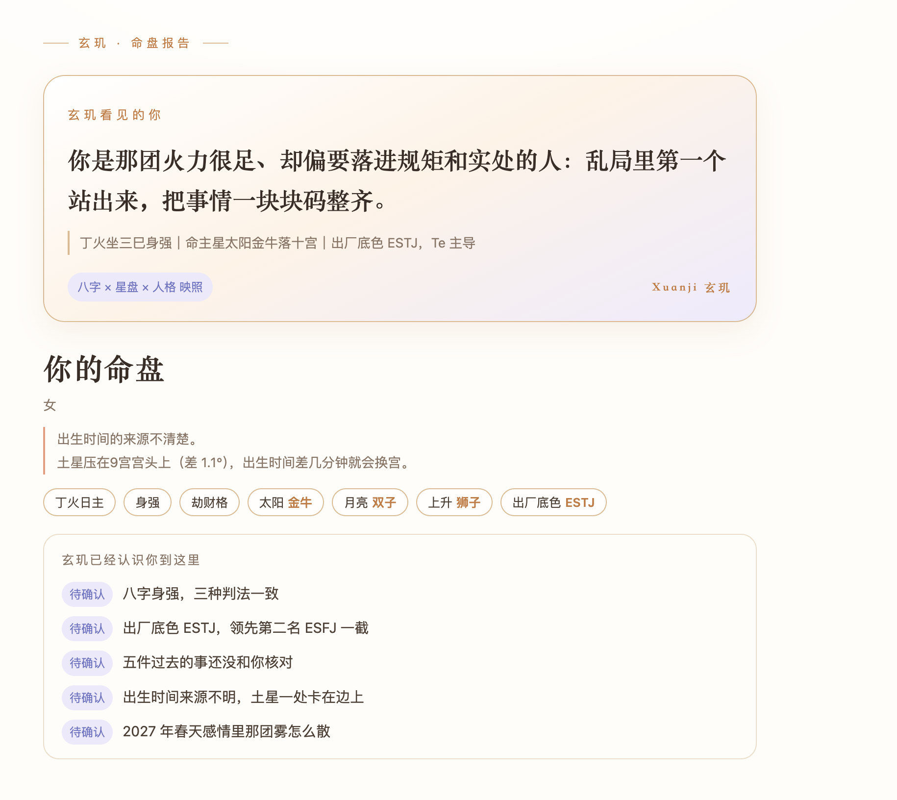
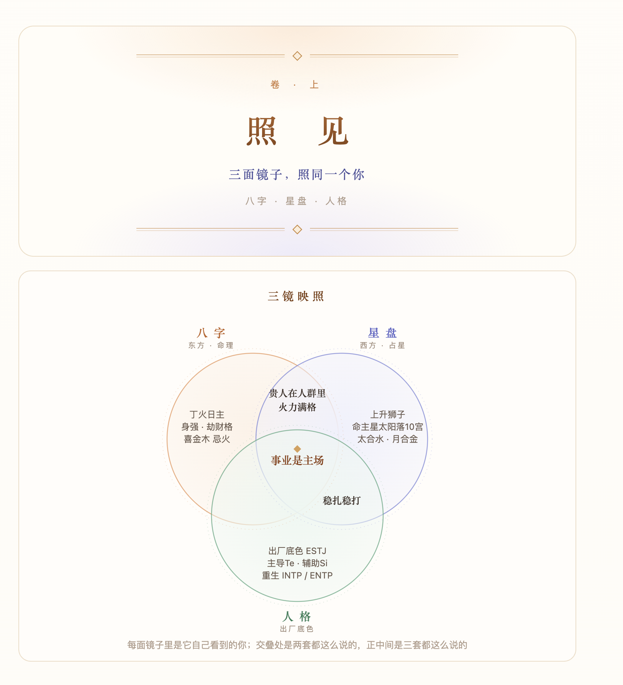
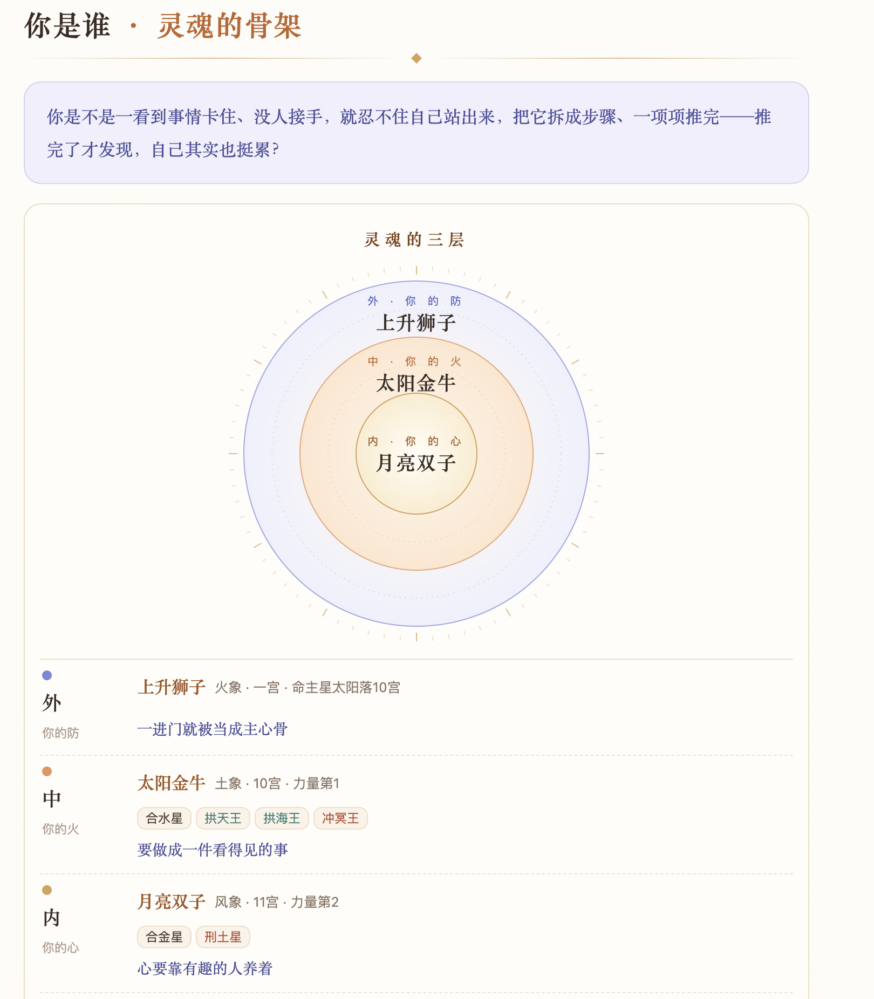
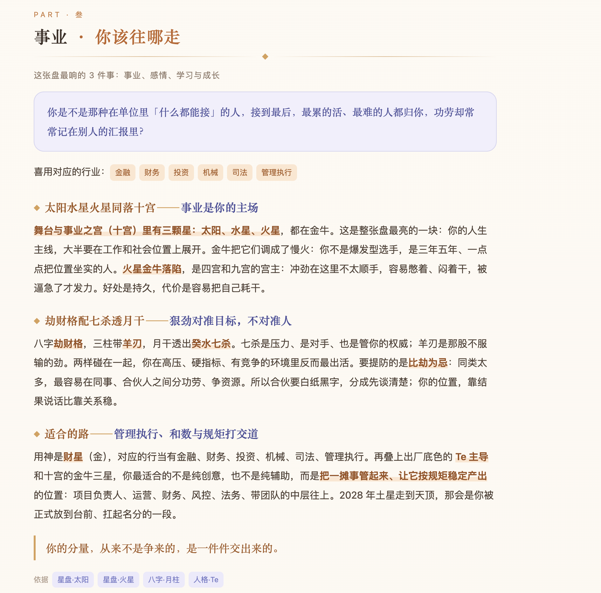
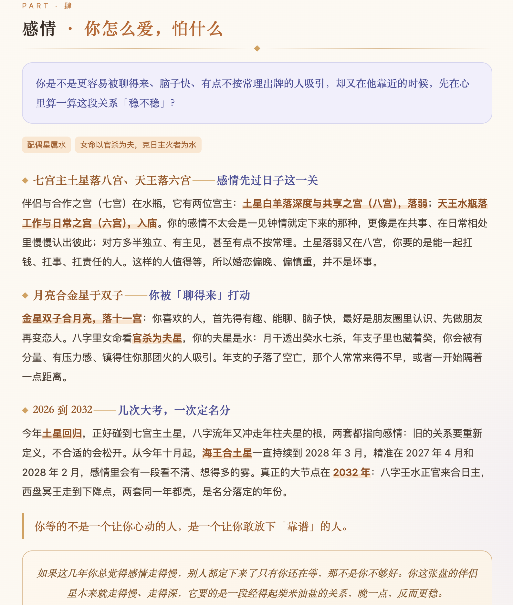
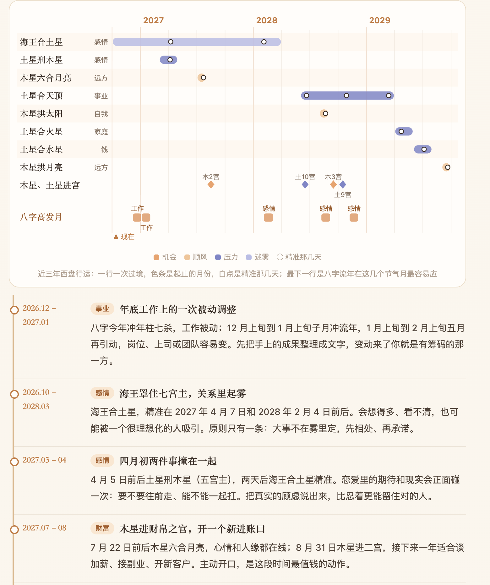
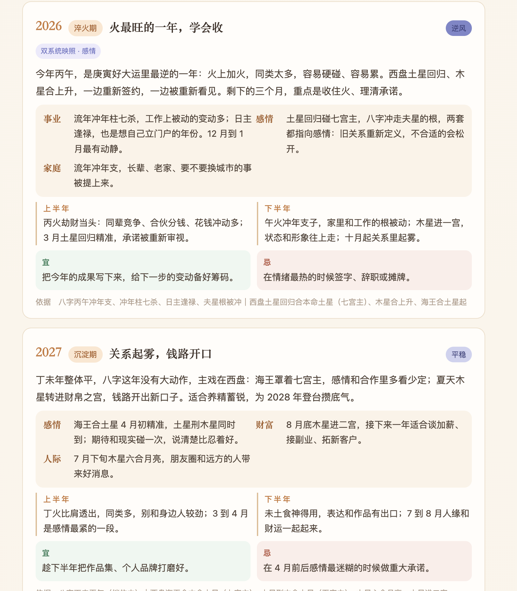

# 执天玄玑 / Xuanji Skill


> **让你的 AI 助手学会看结构。**
>
> 装上它，支持 Skill 的 AI（Claude Code、Codex 等）就能调用执天玄玑 API：排八字和西洋星盘，理解你的出厂底色、重生人格和人格 Buff，看两个人的关系，也可以生成一份离线 HTML 品牌报告。
>
> 玄玑不只是在回答“你是什么性格”，而是在看几个真正重要的人生命题：**你是谁（人格、天赋、优势、盲区），你适合做什么（事业、职业方向、工作方式），你怎么创造和留住价值（财富、资源、赚钱方式），你怎么和人建立关系（亲密关系、合作关系、相处模式），以及你现在走到哪里、接下来什么阶段更适合做什么（时间、阶段、选择）。**
>
> 它说话的方式是「**用命，不算命**」。不是告诉你“命里注定什么”，而是帮你看清：**我是谁，我适合什么，我怎么赚钱，我怎么和人相处，我现在走到哪一步，以及接下来该怎么更好地使用自己。**
>
> **盘先提出假设，现实负责验证。结构告诉你自己是谁，时间告诉你现在走到哪里。**

> 由杭州强势播传文化影视传媒有限公司提供。它是面向 AI 助手的 Skill/API 客户端，不是"执天玄玑自研大模型"；服务可以使用自有算法、规则系统及第三方 AI 服务。当前计算 API 仍为预览入口，不承诺正式服务 SLA。

## 装好之后是什么体验

你在自己的 AI 里说一句：

> **用 Xuanji 看我的人格结构**

它会先问你的出生日期、出生时间、出生城市和性别，征得你同意后调用执天玄玑 API。

但玄玑不会拿到一张盘就急着往下讲。

它会先做两层校准。

**第一层，校出生时间。**

玄玑会先处理真太阳时、夏令时，再看你的出生时间离八字时辰交界、上升、天顶、宫位边界有多远。

如果差几分钟根本不影响主要结构，就直接继续。

如果刚好卡在交界附近，它会明确告诉你：**这张盘对出生时间敏感。**

真的卡在两个时辰之间时，玄玑会把两张盘都排出来，再用你真实经历过的大事做对照。只记录年份和事件类型，在本地按固定规则打分；证据够才定，分不出来就保留两种可能，不硬凑答案。

**第二层，校身强身弱。**

玄玑不会只听一种算法，而是让三套判法分别判断。

如果几种方法方向一致，就继续往下。

如果它们打架，玄玑不会随便选一个，而是从你的盘里挑几段最有区分度、你自己又记得清楚的年份，把两种判断下可能发生的情况同时给你看。

你只需要告诉它：

> **哪一种更像我真实经历过的那几年。**

它不会提前告诉你哪边代表身强、哪边代表身弱。

证据够，才定下来；证据不够，就先不定。真的核出原判断反了，后面的喜用、用神和时间线也会一起重排，不会一边改了、一边还沿用旧结论。

两层校准之后，它才真正开始读你。

它会先像一个第一次见你的老命理师一样，说出几件带年份的往事，请你逐条回答：

> **准 / 部分准 / 不准**

再继续展开你真正关心的人生命题：

**我是谁，我适合做什么，我怎么赚钱，我怎么和人相处，我现在走到哪一步，以及接下来怎么更好地使用自己。**

你也可以继续问事业、财富、关系、合作和当前阶段。

说一句：

> **生成报告**

它会给你一份离线 HTML 报告，双击就能打开，不联网、无追踪。报告分八章：事业、财富、学业、感情、家庭、社交与声誉、健康、成长与课题；页面右上角可以「存为 PDF」。

下面是同一份合成数据报告的视觉示例：先看见你的命盘，再从八字、星盘、人格三面镜子认识自己。点击图片可看原尺寸。

<p></p>
<p>


</p>

正文示例：事业与感情。

<p>


</p>

最后看流年：先看时间轴上的转折，再读逐年的提醒。

<p>


</p>

截图取自 rc.3 的合成数据报告，只展示版式与内容结构，不是真人资料，也不等于 rc.5.2 的完整功能验收；当前功能以本页说明为准。

玄玑的方法很简单：

> **盘先提出假设，现实负责验证。**
>
> **能确定的才确定，不能确定才是你人生的高歌,玄玑会陪你走过人生的每一刻。**


## 安装（三步）

前提：Node.js ≥ 18.19.1。无 npm/pip 第三方依赖，无需模型 Key、CloudBase Key 或数据库配置。克隆安装另需 Git。

1. 拿到 `xuanji/` 目录，二选一：
   - 下载发布包 `Xuanji-Skill-0.1.0-rc.5.2.zip`，解压到一个**新建的空目录**（macOS 可用 Finder 或 `ditto -x -k`，Linux 用支持 UTF-8 文件名的解压工具，Windows 用系统解压或 PowerShell `Expand-Archive`）。解压后核对 `reference/报告.md` 存在。
   - 或克隆本仓库：`git clone <本仓库地址> xuanji`
2. 把整个 `xuanji/` 目录放进你的 AI 宿主的技能目录。Codex 示例：复制到项目的 `.agents/skills/xuanji/`；其他宿主按各自的方式安装。不要只复制 SKILL.md，否则脚本和模板缺失；不要覆盖现有同名 Skill。本仓不自动安装、不修改宿主设置。
3. **新开会话**，输入「用 Xuanji 看我的人格结构并生成 HTML」。宿主需有授权的联网工具及 Node 执行工具；不支持脚本执行的宿主只能改用 [API 契约](docs/api.md) 的 HTTP 方式。

进目录可以先跑两条命令自检：

```sh
npm test
node scripts/client.mjs health
```

## 命令行使用

下面的命令写的是包内相对路径，方便在包目录里自测。宿主（AI）实际给用户用时，在用户自己的工作目录里用 Skill 目录的绝对路径调用（`node <skill目录>/scripts/…`），文件都写在用户的工作目录，不写进 Skill 目录；见 SKILL.md「文件放在哪」。

把请求写入本地 `request.json`（合成示例见 [接口文档](docs/api.md)），不要把实际生辰放在 shell 参数或 Git：

```sh
node scripts/client.mjs profile --input request.json --output profile.json
node scripts/client.mjs pair --input pair-request.json --output pair.json
node scripts/build_report.mjs --profile profile.json --report report.json --out report.html
node scripts/rectify.mjs check --profile profile.json --request request.json --output request_alt.json
node scripts/rectify.mjs ask --a profile.json --b profile_alt.json --events events.json --output ask.json
node scripts/rectify.mjs score --a profile.json --b profile_alt.json --events events.json --ask ask.json --answers answers.json --output rectify.json
node scripts/build_report.mjs --profile profile.json --report report.json --rectify rectify.json --out report.html   # 定过时辰的
node scripts/check_report.mjs --request request.json --report report.html   # 只打有／没有生辰
```

后三行（rectify 系列）是定时辰：出生时间卡在时辰交界时，只读本地文件打分，不联网；用户说的大事不发给接口。流程见 [reference/定时辰.md](reference/定时辰.md)。

单人品牌 `report.json` 格式与完整写法见 [reference/报告.md](reference/报告.md)。用户要单人报告才生成；hits 只放用户答准／部分准的候选核对，未核对或跳过时留空，不准的不放入。

## 边界与验收

我们把限制集中说在这里，每一条都是实测过的实话。

**已验证的 AI 宿主**：macOS arm64 上的 Claude Code 2.1.292（rc.5.2，2026-10-06 真实宿主验收：发现 Skill、排盘、生成报告（八章含学业，可存为 PDF）；文件只建在启动宿主的工作目录，Skill 目录不被改动；报告和命令里没有出生信息）。定时辰流程在 rc.5.1 上用 Claude Code 2.1.291 验过，这一版没有改动它。Kimi Code、Codex 及其他宿主未通过完整验收。Codex 本地项目安装路径为本轮使用的安装路径；本机 Codex CLI 因版本/账号模型兼容错误未能完成 AI 流程，不能说它已通过宿主验收。宿主验收步骤见 `docs/host-acceptance.md`。不能声称已验证所有宿主。

**平台支持**：macOS arm64 及 Linux 普通用户容器的本地脚本实测结果随候选交付；Linux 容器不是 Linux AI 宿主验收。Windows 权限实现已纳入，实际 Windows/宿主验收待完成，不宣称已验证支持。Windows 实现要求本地 NTFS、内置 Windows PowerShell 5.1 及系统允许执行本包脚本；FAT、网络共享、WSL 映射盘不在 Windows 权限实现范围。被系统策略禁止时如实报错，不使用 ExecutionPolicy Bypass、不关闭安全检查。不修改全局 locale。[跨系统验收](docs/cross-platform-acceptance.md)列出剩余步骤。

**隐私**：V1 不要求玄玑账号，不接我的档案库 / Personal Graph，不向玄玑长期人物档案保存请求。出生信息会经 HTTPS 发给 API；AI 宿主可能保存对话，本地请求与结果文件也不会自动删除。真实结果只在授权本地位置保存，文件权限尽量限制为本人可读；不要公开请求、结果、报告或对话。传输同意不等于授权云端长期存档，V1 没有存档功能。

**私有文件的创建**：宿主把 JSON 通过工具标准输入交给 `node scripts/create_private_json.mjs request.json`（report.json 同理），不把生辰放进命令参数。macOS/Linux 以 600 独占创建并检查本人所有权；Windows 用受保护的仅当前用户 NTFS ACL 在创建时设置，不是事后 icacls，也不声称 Windows 的 600 代表安全。请求、接口结果、报告稿和 HTML 输出共用权限实现，拒绝覆盖，不改其他文件。操作系统管理员及宿主本身仍可有额外能力，不能承诺绝对仅本人可见。标准输入、工具和对话可能被宿主保留；请求文件内容会发送给 API。

宿主没有独立标准输入通道时，用 `node scripts/create_private_json.mjs --empty request.json` 先独占创建受保护空文件，再用正常写文件工具原地写入。报告稿同样处理。禁止 printf、heredoc、重定向或命令参数承载 JSON，不关闭安全检查。写后执行 `node scripts/check_private_file.mjs request.json`（report.json 同理）；客户端/构建器读取前再检查。若工具替换文件破坏权限，停止，不发请求、不构建、不用 chmod/icacls 补救。文件不会自动删除。

**API 与网络**：默认 API 为 `https://api.xuanji-astro.com`，只能访问固定三条路径，不接受自定义服务器或重定向。无需环境变量；传 `--api`、凭证或保存 endpoint 会拒绝。超时默认 90 秒，可用 `--timeout-ms 1000` 缩短；不自动重试。网络必须遵守宿主/组织代理规则，脚本本身不提供代理隧道，也不允许用它绕过安全策略。

在需要 HTTP 代理的环境，Node18 的内建 fetch 不会因为设置 HTTP_PROXY 就自动走代理；不要据此直连。可采用宿主已授权 HTTP 工具，或经允许使用支持 `--use-env-proxy` 的 Node 版本。本轮真实 API 链路在 macOS arm64、Node 25.9.0 上，通过授权 IPv4 本机代理验证；Node 18.19.1 验证的是本地测试和渲染，不混称代理链路已通过。代理地址按用户环境设置，不能要求安装者照搬我们的内部地址；保留 TLS 证书校验。

**报告模板**：rc.4 恢复获批的语气、安全规则、首屏展开、字段说明、候选核对、合盘对话及单人「照见」品牌模板、图表与报告写法，使用内联 JS/SVG 离线渲染，CSP 禁止联网，无外部字体/追踪。模板去掉存档框及原始出生日期、时间、地点，仍包含盘面衍生数据，不可称匿名。合盘仅对话，不出合盘 HTML。旧安全纯文本渲染器保留作为兼容工具，不作为合盘报告入口；它接受的格式如下（**不是品牌报告格式**）：

```json
{"title":"合成报告","summary":"依据 API 返回作解释，不伪造结果。","sections":[{"title":"依据","text":"此处由用户授权的 AI 宿主根据接口返回填写。"}]}
```

**rc.5.2 新增**：单人报告加「学业」一章，放在财富后面，共八章；原「学习与成长」改叫「成长与课题」，只讲人生课题。报告页右上角可「存为 PDF」（走浏览器打印，A4，打印前展开所有折叠）。排盘前的同意更严格：用户在请求里给了生辰、说「帮我排盘」都不算同意，要先说明、等用户明确回答。报告里说过去某一年发生了什么，只用八字和星盘同一年、同一块都亮的那块。

**更早的版本**：rc.5 加入定时辰流程；rc.4.2 恢复直接陈述接口候选、最后核对的开场（核对前不算已确认，否认项不进 hits），在服务器人格原句旁显示用户对该句的反馈（需精确原句映射，不改服务器原句），增加 Linux POSIX 处理及待 Windows 实测的 NTFS ACL 实现。合盘仍只计算及对话，不提供面向用户的报告文件。

**报错**：错误代码/恢复方法见 [docs/api.md](docs/api.md)。不展示服务器原始错误、内部路径或栈。

## 许可证与服务

本包代码、文档、获批指引、单人报告模板／写法／构建器／规则采用 Apache-2.0，见[文件许可范围](docs/license-scope.md)。许可方向已批准并完成文件核验与标注。API 服务权限不由源码许可授予。服务端引擎、判词库、内部 Prompt 不在包中，AGPL 排盘服务独立维护，不打包其源码或依赖。

Apache-2.0 不自动授权执天玄玑名称、Logo、官方身份。允许正常生成、保存和依法分享报告及原样转发官方包；个人和企业可正常使用并辅助服务付费客户。官方 API 额度／频率／禁止未经授权代理转售等规则不限制开源文件商用；不得冒充官方，见 TRADEMARKS.md。

用户协议（Terms of Service）：https://xuanji-astro.com/terms

隐私政策（Privacy Policy）：https://xuanji-astro.com/privacy

当前版本 0.1.0-rc.5.2 是公开的候选版（Release Candidate）。

## 找到我们

Skill 在候选期内，主站也在内测。想进内测、用上了想聊聊，或者发现问题，加创始人微信最快——扫码备注「GitHub」，拉你进内测群：


手机上扫不了同屏的码，也可以直接搜微信号 **liin1223** 添加。

费用：预览期免费（限频）。正式版按额度收费，定价页随后公布。
